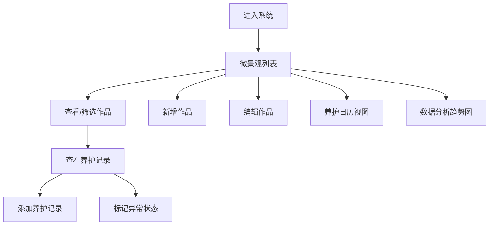

## 1. 产品概述

苔藓微景观工作室管理系统，用于记录和管理苔藓瓶作品的养护信息，包括微景观档案、养护记录、异常状态追踪、湿度观察和生长趋势分析。帮助工作室系统化管理苔藓作品，提升养护质量和工作效率。

## 2. 核心功能

### 2.1 用户角色

| 角色 | 注册方式 | 核心权限 |
|------|----------|----------|
| 工作室管理员 | 本地使用 | 完整的数据管理权限，包括作品增删改查、养护记录、趋势分析 |

### 2.2 功能模块

1. **微景观列表**：作品档案管理，支持增删改查、品种筛选、状态筛选
2. **养护记录**：记录每次喷雾、浇水、清洁等养护操作
3. **异常状态标记**：黄化、霉斑等异常情况记录及处理说明
4. **湿度观察**：湿度区间记录和变化追踪
5. **养护日历**：日历视图展示养护历史和计划
6. **趋势图**：生长状态、湿度变化的数据可视化分析

### 2.3 页面详情

| 页面名称 | 模块名称 | 功能描述 |
|----------|----------|----------|
| 微景观列表 | 作品表格 | 展示所有作品，支持搜索、筛选、分页 |
| 微景观列表 | 新增/编辑弹窗 | 表单录入作品信息，含完整验证 |
| 微景观列表 | 状态标记 | 快速标记作品状态（正常/黄化/霉斑/已售出） |
| 养护记录 | 记录列表 | 按作品展示养护历史记录 |
| 养护记录 | 新增养护 | 录入养护操作、湿度、状态变化 |
| 养护日历 | 日历视图 | 月历展示每日养护情况 |
| 数据分析 | 趋势图 | ECharts 展示湿度、状态变化趋势 |
| 数据分析 | 品种统计 | 各品种数量和状态分布 |

## 3. 核心流程

用户进入系统后，可在微景观列表中查看和管理所有作品档案；点击作品可查看详细养护记录，添加新的养护操作；在日历视图中直观查看养护安排；在数据分析页面通过图表了解整体生长趋势。

## 4. 用户界面设计

### 4.1 设计风格

- **主色调**：苔藓绿 (#2d5a3d) 为主色，搭配自然米色背景
- **辅助色**：暖黄色用于提醒，红色用于异常状态
- **整体风格**：清新自然、简约精致，符合苔藓微景观的自然美学
- **布局**：左侧导航 + 右侧内容区，卡片式布局
- **字体**：使用优雅的中文衬线体标题 + 现代无衬线正文字体组合

### 4.2 页面设计概览

| 页面名称 | 模块名称 | UI 元素 |
|----------|----------|---------|
| 微景观列表 | 顶部工具栏 | 搜索框、品种筛选下拉、状态筛选标签、新增按钮 |
| 微景观列表 | 数据表格 | 作品卡片/表格，状态标签，操作按钮 |
| 养护记录 | 时间线 | 养护记录时间线展示，状态变化标记 |
| 养护日历 | 月历 | 日期格子，养护数量标记，hover 详情 |
| 数据分析 | 图表卡片 | ECharts 折线图、柱状图、饼图 |

### 4.3 响应式

桌面端优先设计，支持平板尺寸自适应。导航栏在小屏幕可折叠为侧边抽屉。

## 5. 业务规则

1. **作品编号唯一性**：作品编号不能重复
2. **日期验证**：制作日期和养护日期不能晚于当前日期
3. **湿度范围**：湿度值必须在 0-100 之间
4. **异常处理说明**：出现黄化或霉斑状态时必须填写处理说明
5. **已售出限制**：已售出作品不能继续新增养护记录
6. **数据持久化**：刷新页面后数据不能丢失（使用 localStorage 存储）
