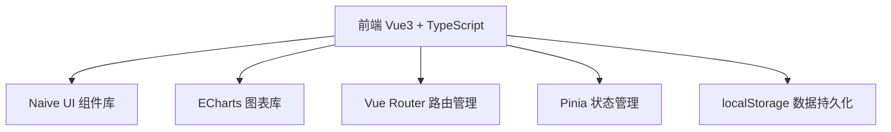
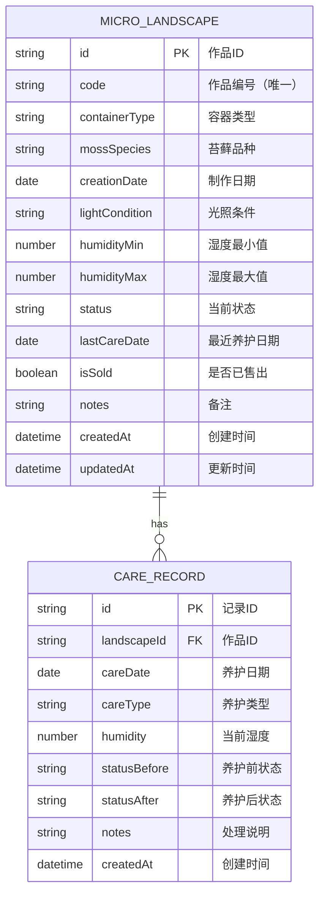

## 1. 架构设计



## 2. 技术栈说明

- **前端框架**：Vue 3 + Composition API + TypeScript
- **UI 组件库**：Naive UI
- **图表库**：ECharts 5
- **路由**：Vue Router 4
- **状态管理**：Pinia
- **构建工具**：Vite
- **样式方案**：Tailwind CSS
- **数据持久化**：localStorage

## 3. 路由定义

| 路由路径 | 页面名称 | 用途 |
|----------|----------|------|
| / | 微景观列表 | 首页，展示所有作品列表 |
| /landscapes/:id | 作品详情 | 单个作品的养护记录和详情 |
| /calendar | 养护日历 | 日历视图展示养护记录 |
| /analytics | 数据分析 | 趋势图和统计图表 |

## 4. 数据模型

### 4.1 数据模型定义



### 4.2 类型定义

```typescript
// 作品状态
type LandscapeStatus = 'healthy' | 'yellowing' | 'mold' | 'sold'

// 养护类型
type CareType = 'spray' | 'water' | 'clean' | 'prune' | 'other'

// 微景观作品
interface MicroLandscape {
  id: string
  code: string
  containerType: string
  mossSpecies: string
  creationDate: string
  lightCondition: string
  humidityMin: number
  humidityMax: number
  status: LandscapeStatus
  lastCareDate: string
  isSold: boolean
  notes: string
  createdAt: string
  updatedAt: string
}

// 养护记录
interface CareRecord {
  id: string
  landscapeId: string
  careDate: string
  careType: CareType
  humidity: number
  statusBefore: LandscapeStatus
  statusAfter: LandscapeStatus
  notes: string
  createdAt: string
}
```

## 5. 项目结构

```
src/
├── components/          # 通用组件
│   ├── LandscapeCard.vue
│   ├── CareTimeline.vue
│   └── StatusTag.vue
├── pages/              # 页面组件
│   ├── LandscapeList.vue
│   ├── LandscapeDetail.vue
│   ├── CareCalendar.vue
│   └── Analytics.vue
├── stores/             # Pinia stores
│   └── landscapeStore.ts
├── types/              # TypeScript 类型定义
│   └── index.ts
├── utils/              # 工具函数
│   ├── storage.ts
│   └── validation.ts
├── router/             # 路由配置
│   └── index.ts
├── App.vue
└── main.ts
```

## 6. 业务验证规则

1. **作品编号唯一性**：新增/编辑时检查编号是否已存在
2. **日期验证**：制作日期和养护日期 ≤ 当前日期
3. **湿度范围**：0 ≤ 湿度值 ≤ 100
4. **异常处理说明必填**：当状态为黄化或霉斑时，处理说明字段必填
5. **已售出限制**：isSold 为 true 的作品不允许新增养护记录
